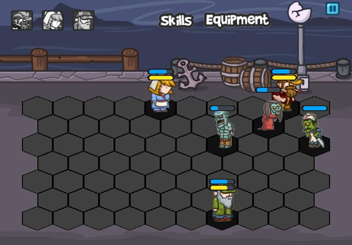
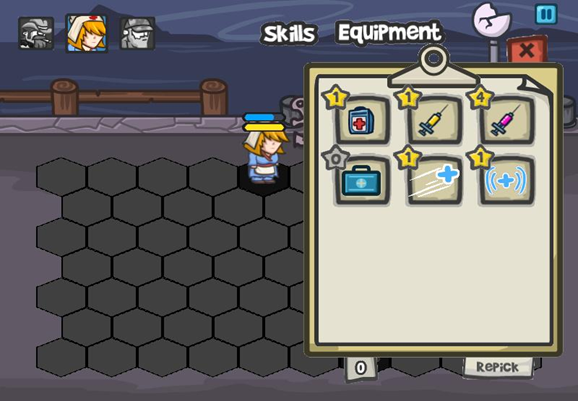
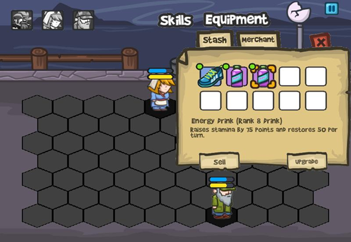
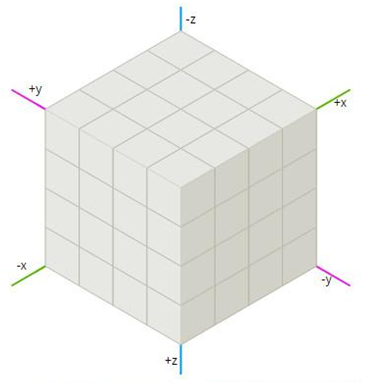
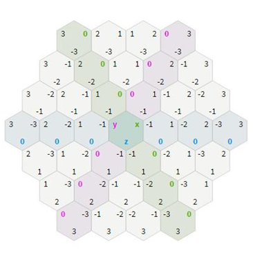
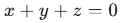
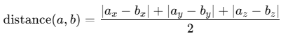
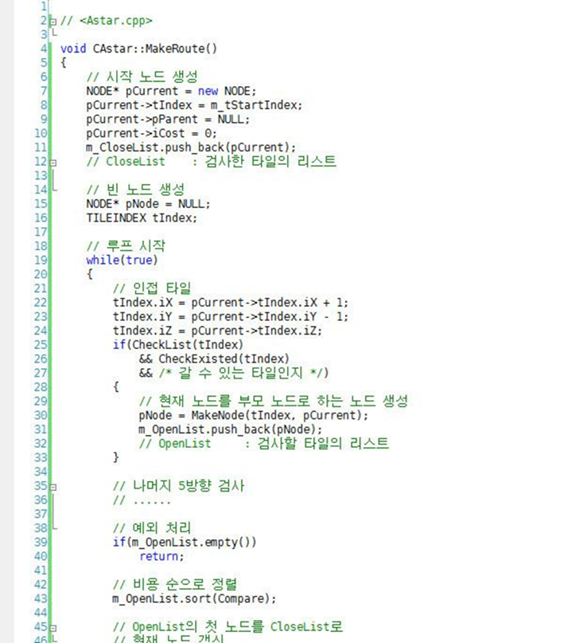
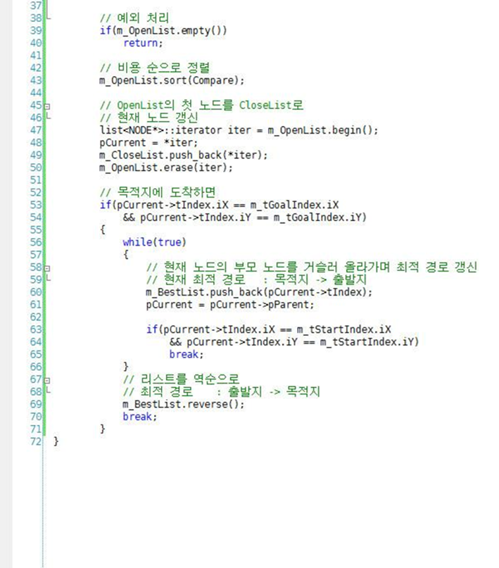

# Zombie Tactics 모작

## 시연 영상 및 게임 소개
  

육각 타일 기반의 턴제 디펜스 게임

- 육각 타일 기반 A* 알고리즘 구현
- 턴제 시스템 구현
- 성장 가능한 스킬, 인벤토리 및 상점 구현
- 베지어 곡선 활용한 투사체 표현

## 핵심 기술

### 육각 타일 기반 A* 알고리즘 구현
육각 타일에서의 길 찾기를 위한 인덱스를 설정하고 해당하는 조건식을 활용해 최적 경로 계산
- 육각 타일 인덱스 설정
  

    
    
  
  
- 평면 조건식  
  
- 거리 계산식  
  
- 최적 경로 계산 (A*)
  

    
    
  

